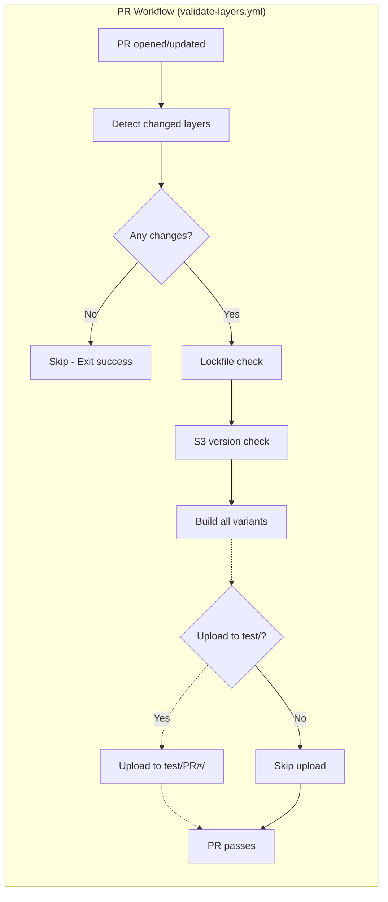
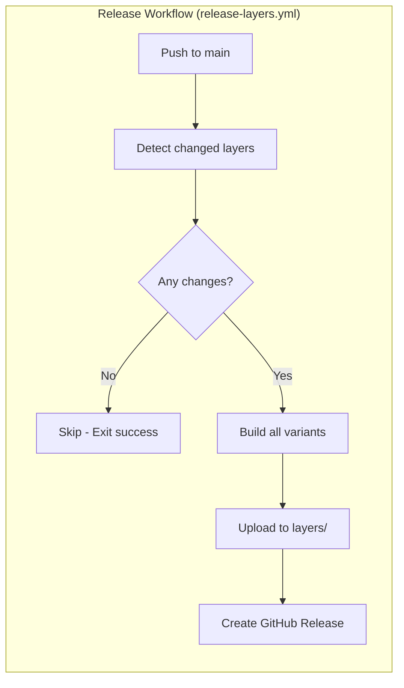

# AWS Lambda Layers

AWS Lambda layers managed with uv and Terraform, with artifacts stored in S3.

## Architecture

```text
┌─────────────────┐     ┌─────────────────┐     ┌─────────────────┐
│  layers/        │     │  S3 Bucket      │     │  AWS Lambda     │
│  (source)       │────▶│  (artifacts)    │────▶│  (deployed)     │
│                 │     │                 │     │                 │
│  pyproject.toml │     │  .zip files     │     │  Layer versions │
│  uv.lock        │     │  (immutable)    │     │                 │
└─────────────────┘     └─────────────────┘     └─────────────────┘
     CI: build            CI: upload            Terraform: deploy
     + validate           (once per version)   (per account)
```

**Key concepts:**

- **Source** (`layers/`) - Layer definitions with dependencies in flat structure
- **Artifacts** (S3) - Built zip files, immutable, shared across accounts
- **Deployed** (Lambda) - Layer versions deployed per AWS account
- **Version in pyproject.toml** - Layer version is defined in `pyproject.toml`, auto-detected on merge to main

## Project Structure

```text
aws-lambda-layers/
├── layers/
│   └── <name>/
│       ├── pyproject.toml     # Dependencies + [tool.lambda_layer] config
│       ├── uv.lock            # Pinned versions (committed)
│       └── src/               # Optional custom Python code
├── scripts/
│   ├── create-layer.sh        # Scaffold new layer
│   ├── build-layer.sh         # Build single layer variant
│   ├── upload-layer.sh        # Upload to S3
│   ├── check-artifacts.sh     # Verify artifacts exist in S3
│   └── validate-config.py     # Validate layer configuration
├── terraform/
│   ├── main.tf                # aws_lambda_layer_version from S3
│   ├── variables.tf           # layers list, artifacts_bucket
│   ├── outputs.tf             # Layer ARNs
│   ├── providers.tf           # AWS provider config
│   └── versions.tf            # Terraform/provider versions
└── .github/workflows/
    ├── validate.yml           # Validate on push/PR
    ├── validate-layers.yml    # PR validation (lockfile, S3 version, build)
    ├── release-layers.yml     # Auto-detect release on push to main
    ├── test-build.yml         # Manual test builds for PRs
    └── release-terraform.yml  # Terraform module release
```

## Layer Configuration

Each layer has a flat structure with `pyproject.toml` containing both dependencies and build configuration:

```toml
# layers/common/pyproject.toml
[project]
name = "common"
version = "1.0"
requires-python = ">=3.11"
dependencies = [
    "requests>=2.31",
    "boto3>=1.34",
]

[tool.lambda_layer]
python_versions = ["3.11", "3.12"]
architectures = ["x86_64", "arm64"]
platforms = { x86_64 = "manylinux2014_x86_64", arm64 = "manylinux2014_aarch64" }
```

| Field | Description |
|-------|-------------|
| `python_versions` | Python versions to build (must be allowed by `requires-python`) |
| `architectures` | CPU architectures to build (`x86_64`, `arm64`) |
| `platforms` | Platform strings for uv pip install targeting |

## S3 Artifacts Bucket

Layer artifacts are stored in a shared S3 bucket. The bucket should be provisioned separately (e.g., by a shared infrastructure Terraform component).

### Required Bucket Configuration

| Setting | Value | Purpose |
|---------|-------|---------|
| **Versioning** | Enabled | Track artifact history, enable recovery |
| **Object Lock** | GOVERNANCE mode (optional) | Enforce immutability (prevent overwrites/deletes) |
| **Bucket Policy** | Cross-account read | Allow target accounts to read artifacts |

### Recommended Bucket Configuration

| Setting | Value | Purpose |
|---------|-------|---------|
| **Cross-Region Replication** | To secondary region(s) | Disaster recovery, reduced latency |
| **Lifecycle Rules** | Transition to IA after 90 days | Cost optimization for old versions |
| **Lifecycle Rules** | Delete `test/` prefix after 7 days | Cleanup test artifacts |
| **Encryption** | SSE-S3 or SSE-KMS | Data at rest encryption |

### S3 Key Structure

The bucket uses two prefixes with different purposes:

```text
s3://<bucket>/
├── layers/                              # Release artifacts (immutable)
│   └── <name>/<version>/
│       ├── py312-x86_64.zip
│       └── py312-arm64.zip
└── test/                                # Test artifacts (7-day lifecycle)
    └── <pr-number>/<name>/<version>/
        ├── py312-x86_64.zip
        └── py312-arm64.zip
```

| Prefix | Purpose | Lifecycle |
|--------|---------|-----------|
| `layers/` | Production release artifacts | Immutable, never overwritten |
| `test/` | PR test builds | Auto-deleted after 7 days |

### Lifecycle Policy for Test Artifacts

Configure a lifecycle rule to automatically clean up test artifacts:

```json
{
  "Rules": [
    {
      "ID": "DeleteTestArtifacts",
      "Status": "Enabled",
      "Filter": {
        "Prefix": "test/"
      },
      "Expiration": {
        "Days": 7
      }
    }
  ]
}
```

### Example Bucket Policy (Cross-Account Read)

**Option 1: Allow entire AWS Organization**

```json
{
  "Version": "2012-10-17",
  "Statement": [
    {
      "Sid": "AllowOrganizationRead",
      "Effect": "Allow",
      "Principal": "*",
      "Action": [
        "s3:GetObject",
        "s3:GetObjectVersion"
      ],
      "Resource": "arn:aws:s3:::BUCKET_NAME/*",
      "Condition": {
        "StringEquals": {
          "aws:PrincipalOrgID": "o-xxxxxxxxxx"
        }
      }
    }
  ]
}
```

**Option 2: Allow specific AWS accounts**

```json
{
  "Version": "2012-10-17",
  "Statement": [
    {
      "Sid": "AllowSpecificAccountsRead",
      "Effect": "Allow",
      "Principal": {
        "AWS": [
          "arn:aws:iam::111111111111:root",
          "arn:aws:iam::222222222222:root"
        ]
      },
      "Action": [
        "s3:GetObject",
        "s3:GetObjectVersion"
      ],
      "Resource": "arn:aws:s3:::BUCKET_NAME/*"
    }
  ]
}
```

## GitHub Actions CI/CD

### Workflows

| Workflow | Trigger | Purpose |
|----------|---------|---------|
| `validate.yml` | Push/PR to `layers/**` | Validate lockfiles and configs |
| `validate-layers.yml` | PR to `layers/**` | PR validation: lockfile check, S3 version check, build |
| `release-layers.yml` | Push to `main` with `layers/**` changes | Auto-detect and release changed layers |
| `test-build.yml` | Manual (workflow_dispatch) | Test build for PRs |
| `release-terraform.yml` | Tag `tf/<version>` | Validate and release Terraform module |

The layer release process uses **auto-detection**: when changes to `layers/**` are merged to main, the CI automatically detects which layers changed, builds all variants, uploads to S3, and creates GitHub releases.

### PR Validation Workflow

The PR validation workflow (`validate-layers.yml`) runs when a pull request is opened or updated with changes to `layers/**`:



### Release Workflow

The release workflow (`release-layers.yml`) runs when changes to `layers/**` are pushed to the main branch:



### Required Repository Variables

Configure these in GitHub repository settings → Secrets and variables → Actions → Variables:

| Variable | Description | Example |
|----------|-------------|---------|
| `LAMBDA_LAYERS_BUCKET` | S3 bucket for artifacts | `my-lambda-layers` |
| `AWS_REGION` | AWS region for deployment | `eu-west-1` |
| `AWS_ROLE_ARN` | IAM role ARN for OIDC auth | `arn:aws:iam::123456789012:role/github-actions` |

### OIDC Authentication Setup

GitHub Actions uses OIDC (OpenID Connect) to authenticate with AWS without long-lived credentials.

**Step 1: Create IAM Identity Provider**

```bash
aws iam create-open-id-connect-provider \
  --url https://token.actions.githubusercontent.com \
  --client-id-list sts.amazonaws.com \
  --thumbprint-list 6938fd4d98bab03faadb97b34396831e3780aea1
```

**Step 2: Create IAM Role with Trust Policy**

```json
{
  "Version": "2012-10-17",
  "Statement": [
    {
      "Effect": "Allow",
      "Principal": {
        "Federated": "arn:aws:iam::ACCOUNT_ID:oidc-provider/token.actions.githubusercontent.com"
      },
      "Action": "sts:AssumeRoleWithWebIdentity",
      "Condition": {
        "StringEquals": {
          "token.actions.githubusercontent.com:aud": "sts.amazonaws.com"
        },
        "StringLike": {
          "token.actions.githubusercontent.com:sub": "repo:ORG/REPO:*"
        }
      }
    }
  ]
}
```

**Step 3: Attach S3 Permissions to Role**

```json
{
  "Version": "2012-10-17",
  "Statement": [
    {
      "Effect": "Allow",
      "Action": [
        "s3:PutObject",
        "s3:GetObject",
        "s3:ListBucket"
      ],
      "Resource": [
        "arn:aws:s3:::BUCKET_NAME",
        "arn:aws:s3:::BUCKET_NAME/*"
      ]
    }
  ]
}
```

For detailed instructions, see [GitHub Actions OIDC with AWS](https://docs.github.com/en/actions/security-for-github-actions/security-hardening-your-deployments/configuring-openid-connect-in-amazon-web-services).

## Procedures

### Create a New Layer

```bash
./scripts/create-layer.sh <name>

# Example:
./scripts/create-layer.sh utils
```

This creates:
- `layers/<name>/pyproject.toml` - Template configuration
- `layers/<name>/uv.lock` - Initial lockfile
- `layers/<name>/src/` - Directory for custom code

### Add Dependencies

```bash
cd layers/<name>
uv add requests boto3-stubs
```

If you edit `pyproject.toml` manually, regenerate the lockfile:

```bash
uv lock
```

### Build Layer Locally

```bash
./scripts/build-layer.sh <name> <python> <arch>

# Example:
./scripts/build-layer.sh common 3.12 x86_64
```

Output: `.build/<name>/dist/py<python>-<arch>.zip`

### Release a Layer

Layers are released automatically when changes are merged to main. The CI detects which layers changed, builds all variants, uploads to S3, and creates GitHub releases.

1. Update version in `pyproject.toml`
2. Update lockfile if needed: `cd layers/<name> && uv lock`
3. Commit changes and create a pull request
4. PR validation runs automatically (lockfile check, S3 version check, build)
5. Get PR reviewed and approved
6. Merge to main - CI automatically detects changes, builds, and publishes

```bash
# Example workflow:
cd layers/common
# Edit pyproject.toml: version = "1.1"
uv lock
git add .
git commit -m "common: bump to 1.1"
git push origin feature/common-1.1
# Create PR, get review, merge
```

The release workflow will:

- Detect which layers changed in the merge commit
- Build all variants defined in `[tool.lambda_layer]`
- Upload artifacts to S3 `layers/<name>/<version>/`
- Create a GitHub Release with release notes

### Test Build on PR (Manual)

To test a layer build before merging:

1. Go to GitHub Actions → Test Build workflow
2. Click "Run workflow"
3. Enter the PR number
4. Artifacts are uploaded to `test/<pr-number>/` in S3

### Deploy with Terraform

```hcl
# terraform.tfvars
artifacts_bucket = "my-lambda-layers"

layers = [
  { name = "common", version = "1.0", python = "312", arch = "x86_64" }
]
```

```bash
cd terraform
terraform init
terraform apply
```

### Deploy Test Layers (from PR)

Use the `s3_prefix` parameter to deploy test artifacts:

```hcl
# terraform.tfvars - Deploy test layer from PR #123
layers = [
  {
    name      = "common"
    version   = "1.0"
    python    = "312"
    arch      = "x86_64"
    s3_prefix = "test/123"  # Points to test artifacts
  }
]
```

This allows testing layer changes in a target AWS account before merging the PR.

### Use Layer in Lambda

Reference the layer ARN from Terraform outputs:

```hcl
resource "aws_lambda_function" "example" {
  # ...
  layers = [module.layers.layer_arns["common-v1.0-py312-x86_64"]]
}
```

## Naming Convention

| Element | Format | Example |
|---------|--------|---------|
| Layer directory | `layers/<name>/` | `layers/common/` |
| S3 key | `layers/<name>/<version>/py<python>-<arch>.zip` | `layers/common/1.0/py312-x86_64.zip` |
| Lambda name | `<name>-v<version>-py<python>-<arch>` | `common-v1.0-py312-x86_64` |
| Git tag (layer) | `layer/<name>/<version>` | `layer/common/1.0` |
| Git tag (terraform) | `tf/<version>` | `tf/1.0.0` |

## Versioning

Layers use X.Y versioning:

| Change | Version | Reason |
|--------|---------|--------|
| Patch dep update (2.28.1 → 2.28.2) | Keep | No API change |
| Minor dep update (2.28 → 2.31) | Y + 1 | New features available |
| Add new dependency | Y + 1 | New features available |
| Major dep update (1.x → 2.x) | X + 1 | API may break |
| Remove dependency | X + 1 | Code using it will break |

## Immutability

Layers are designed to be **immutable** - once released, they should never be modified:

| Component | Enforcement |
|-----------|-------------|
| **Source** (`layers/`) | Version in Git tag, not in directory structure |
| **Artifacts** (S3) | Upload script checks existence before upload |
| **Lambda Layer** | New deployment creates new version number |

## Troubleshooting

### Missing Artifact in S3

If Terraform fails with `NoSuchKey` error:

```bash
# Check if artifact exists
./scripts/check-artifacts.sh <name> <version> <bucket>

# Example:
./scripts/check-artifacts.sh common 1.0 my-lambda-layers
```

**Scenario 1: CI build failed after tag was pushed**

```bash
# Delete and recreate the tag to trigger CI rebuild
git tag -d layer/<name>/<version>
git push origin :refs/tags/layer/<name>/<version>
git tag layer/<name>/<version>
git push origin --tags
```

**Scenario 2: Tag exists but was never pushed**

```bash
git push origin layer/<name>/<version>
```

**Scenario 3: Need to rebuild with updated dependencies**

```bash
# Update version in pyproject.toml
# Edit layers/<name>/pyproject.toml: version = "X.Y+1"

# Update lockfile
cd layers/<name>
uv lock

# Commit and create new tag
git add layers/<name>/
git commit -m "<name>: bump to X.Y+1"
git tag layer/<name>/X.Y+1
git push origin main --tags
```

### Re-running Failed CI Build

If CI build failed due to transient error:

1. Go to GitHub Actions → Release Layer workflow
2. Find the failed run for your tag
3. Click "Re-run all jobs"

Note: Re-running will fail if artifacts already exist in S3 (immutability check).

### Lockfile Out of Date

If validation fails with lockfile error:

```bash
cd layers/<name>
uv lock
git add uv.lock
git commit -m "<name>: update lockfile"
```

### Python Version Not Allowed

If validation fails with Python version error, ensure `python_versions` in `[tool.lambda_layer]` are allowed by `requires-python`:

```toml
# Wrong: 3.10 not allowed by >=3.11
requires-python = ">=3.11"
[tool.lambda_layer]
python_versions = ["3.10", "3.12"]  # Error!

# Correct
requires-python = ">=3.11"
[tool.lambda_layer]
python_versions = ["3.11", "3.12"]  # OK
```

### Verifying Layer Deployment

After Terraform apply:

```bash
# List layer versions
aws lambda list-layer-versions --layer-name <layer-name>

# Get layer ARN from Terraform output
cd terraform
terraform output layer_arns
```

## Pre-commit Hooks

Install pre-commit hooks to validate before committing:

```bash
pip install pre-commit
pre-commit install
```

Hooks validate:
- `uv.lock` files are up-to-date
- Layer configurations are valid
- Terraform formatting

## References

- [uv AWS Lambda Integration Guide](https://docs.astral.sh/uv/guides/integration/aws-lambda/) - Official uv documentation for Lambda deployment
- [AWS Lambda Layers Documentation](https://docs.aws.amazon.com/lambda/latest/dg/chapter-layers.html) - AWS documentation on Lambda layers
- [GitHub Actions OIDC with AWS](https://docs.github.com/en/actions/security-for-github-actions/security-hardening-your-deployments/configuring-openid-connect-in-amazon-web-services) - Setting up OIDC authentication
- [uv Documentation](https://docs.astral.sh/uv/) - Python package manager documentation
