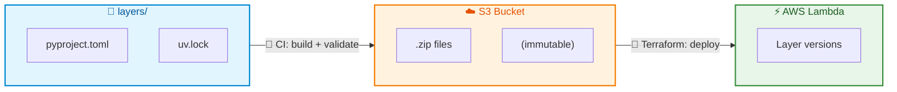
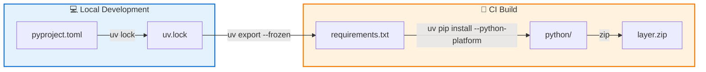
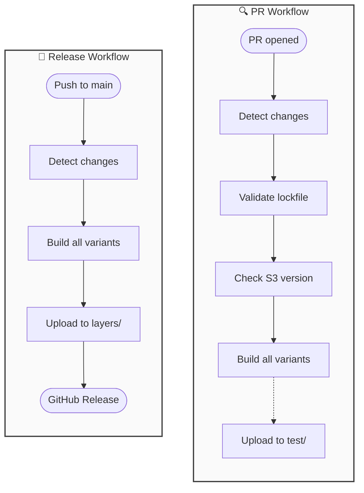

# AWS Lambda Layers

[](https://github.com/luk-kop/aws-lambda-layers/actions/workflows/validate-layers.yml)
[](https://github.com/luk-kop/aws-lambda-layers/actions/workflows/release-layers.yml)
[](https://www.python.org/downloads/)
[](https://www.terraform.io/)
[](https://docs.astral.sh/uv/)

AWS Lambda layers managed with uv and Terraform, with artifacts stored in S3.

## Architecture



**Key concepts:**

- **Source** (`layers/`) - Layer definitions with dependencies in flat structure
- **Artifacts** (S3) - Built zip files, immutable, shared across accounts
- **Deployed** (Lambda) - Layer versions deployed per AWS account
- **Version in pyproject.toml** - Layer version is defined in `pyproject.toml`, auto-detected on merge to main

## Quick Start

```bash
# Create a new layer
./scripts/create-layer.sh mylib

# Add dependencies
cd layers/mylib
uv add requests boto3

# Release (commit, PR, merge to main)
git add .
git commit -m "mylib: initial release"
git push origin feature/mylib
# Create PR → merge → CI builds and publishes automatically
```

## Documentation

| Document | Description |
|----------|-------------|
| [Setup Guide](docs/SETUP.md) | One-time setup: S3 bucket, GitHub config, OIDC authentication |
| [Usage Guide](docs/USAGE.md) | Daily operations: create, build, release, deploy layers |
| [Troubleshooting](docs/TROUBLESHOOTING.md) | Common issues and solutions |

## Project Structure

```text
aws-lambda-layers/
├── layers/
│   └── <name>/
│       ├── pyproject.toml     # Dependencies + [tool.lambda_layer] config
│       ├── uv.lock            # Pinned versions (committed)
│       └── src/               # Optional custom Python code
├── scripts/
│   ├── create-layer.sh        # Scaffold new layer
│   ├── build-layer.sh         # Build single layer variant
│   ├── upload-layer.sh        # Upload to S3
│   ├── check-artifacts.sh     # Verify artifacts exist in S3
│   └── validate-config.py     # Validate layer configuration
├── terraform/
│   ├── main.tf                # aws_lambda_layer_version from S3
│   ├── variables.tf           # layers list, artifacts_bucket
│   ├── outputs.tf             # Layer ARNs
│   ├── providers.tf           # AWS provider config
│   └── versions.tf            # Terraform/provider versions
└── .github/workflows/
    ├── validate-layers.yml    # PR validation (lockfile, S3 version, build)
    ├── release-layers.yml     # Auto-detect release on push to main
    └── release-terraform.yml  # Terraform module release
```

## Layer Configuration

Each layer has a flat structure with `pyproject.toml` containing both dependencies and build configuration:

```toml
# layers/common/pyproject.toml
[project]
name = "common"
version = "1.0"
requires-python = ">=3.11"
dependencies = [
    "requests>=2.31",
    "boto3>=1.34",
]

[tool.lambda_layer]
python_versions = ["3.11", "3.12"]
architectures = ["x86_64", "arm64"]
platforms = { x86_64 = "x86_64-manylinux2014", arm64 = "aarch64-manylinux2014" }
```

| Field | Description |
|-------|-------------|
| `python_versions` | Python versions to build (must be allowed by `requires-python`) |
| `architectures` | CPU architectures to build (`x86_64`, `arm64`) |
| `platforms` | Platform strings for uv pip install targeting |

## Build Process and Dependency Resolution

The build process uses [uv](https://docs.astral.sh/uv/) to resolve and install dependencies for Lambda's Linux environment.

### How It Works



1. **Lock dependencies** (`uv lock`) - Creates `uv.lock` with pinned versions. Run locally when adding/updating dependencies.

2. **Export requirements** (`uv export --frozen`) - Converts lockfile to `requirements.txt` during build. The `--frozen` flag ensures exact versions from lockfile are used.

3. **Install for target platform** (`uv pip install --python-platform`) - Downloads wheels for Lambda's Linux environment, even when building on macOS or Windows.

### One Lockfile, Multiple Python Versions

uv's lockfile supports multiple Python versions simultaneously. When you run `uv lock`, it resolves dependencies for all Python versions allowed by `requires-python`:

```toml
[project]
requires-python = ">=3.11"  # Allows 3.11, 3.12, 3.13, etc.

[tool.lambda_layer]
python_versions = ["3.11", "3.12"]  # Build for these versions
```

The lockfile contains version-specific resolution:
- If a package has different versions for Python 3.11 vs 3.12, both are recorded
- During build, uv selects the correct version based on `--python` flag
- This ensures reproducible builds across all Python versions from a single lockfile

### Cross-Platform Building

The `--python-platform` flag tells uv to download wheels for Lambda's Linux environment:

```bash
uv pip install \
    --python-platform "x86_64-manylinux2014" \
    --python "3.12" \
    --target ".build/python" \
    -r requirements.txt
```

This means you can build Lambda layers on any OS (macOS, Windows, Linux) and get the correct Linux-compatible wheels.

### Build Optimizations

The build script applies several optimizations to reduce layer size:

- `--no-installer-metadata` - Removes pip metadata files
- `--no-compile-bytecode` - Skips `.pyc` generation (Lambda compiles on first run)
- Cleanup of `__pycache__`, `*.dist-info`, and `*.pyc` files

## CI/CD Workflows



| Workflow | Trigger | Purpose |
|----------|---------|---------|
| `validate-layers.yml` | PR to `layers/**` | Validate lockfile, check S3 version, build |
| `release-layers.yml` | Push to `main` with `layers/**` changes | Build, upload to S3, create GitHub release |
| `release-terraform.yml` | Tag `<version>` | Release Terraform module |

## Naming Convention

| Element | Format | Example |
|---------|--------|---------|
| Layer directory | `layers/<name>/` | `layers/common/` |
| S3 key | `layers/<name>/<version>/py<python>-<arch>.zip` | `layers/common/1.0/py312-x86_64.zip` |
| Lambda name | `<name>-v<version>-py<python>-<arch>` | `common-v1.0-py312-x86_64` |
| Git tag (layer) | `layer/<name>/<version>` | `layer/common/1.0` |
| Git tag (terraform) | `<version>` | `1.0.0` |

## Versioning

Layers use X.Y versioning:

| Change | Version | Reason |
|--------|---------|--------|
| Patch dep update (2.28.1 → 2.28.2) | Keep | No API change |
| Minor dep update (2.28 → 2.31) | Y + 1 | New features available |
| Add new dependency | Y + 1 | New features available |
| Major dep update (1.x → 2.x) | X + 1 | API may break |
| Remove dependency | X + 1 | Code using it will break |

## Immutability

Layers are designed to be **immutable** - once released, they should never be modified:

| Component | Enforcement |
|-----------|-------------|
| **Source** (`layers/`) | Version in Git tag, not in directory structure |
| **Artifacts** (S3) | Upload script checks existence before upload |
| **Lambda Layer** | New deployment creates new version number |

## Terraform Layer Deployment

When Terraform deploys a layer to AWS, it creates an `aws_lambda_layer_version` resource. AWS Lambda assigns an internal version number (1, 2, 3...) to each layer version.

**Our approach: Version in layer name, not AWS version number**

```text
Layer name: common-v1.0-py312-x86_64  →  AWS version: 1
Layer name: common-v1.1-py312-x86_64  →  AWS version: 1  (different layer)
```

Each unique combination of name + version + python + arch creates a **separate Lambda layer** in AWS. Since S3 artifacts are immutable, the AWS version number is always 1 - the artifact never changes after release.

### Why this approach?

The standard AWS approach uses a single layer name (e.g., `common`) and increments AWS version numbers (1, 2, 3...) with each update. Our approach embeds the version in the layer name itself. Here's why:

| Concern | AWS Version Approach | Our Approach (Version in Name) |
|---------|---------------------|-------------------------------|
| Rollback | Delete latest version, redeploy | Change version in tfvars |
| Multi-account | Version numbers differ per account | Same layer name everywhere |
| Audit trail | AWS versions are opaque (1, 2, 3) | Version visible in layer name |
| Terraform state | Must track AWS version numbers | Layer name is the identifier |
| Immutability | Can overwrite by redeploying | S3 artifact is immutable |

- **Rollback**: With AWS versions, rolling back requires deleting the latest version and redeploying. With our approach, just change `version = "1.1"` back to `version = "1.0"` in tfvars - both layers exist side by side.

- **Multi-account**: If you deploy to dev first, then prod, AWS assigns version numbers independently. Dev might have versions 1-5, prod has 1-3. With our approach, `common-v1.0-py312-x86_64` is the same everywhere.

- **Audit trail**: When a Lambda uses layer version 3, you need to check AWS to see what that contains. With our approach, `common-v1.0-py312-x86_64` tells you exactly what version is deployed.

- **Terraform state**: AWS version numbers are assigned at deploy time, so Terraform must query AWS to know the current version. With our approach, the layer name is deterministic from the configuration.

- **Immutability**: With AWS versions, redeploying the same layer name creates a new version, potentially with different content. With our approach, `common-v1.0` always points to the same immutable S3 artifact.

## References

- [uv AWS Lambda Integration Guide](https://docs.astral.sh/uv/guides/integration/aws-lambda/) - Official uv documentation for Lambda deployment
- [AWS Lambda Layers Documentation](https://docs.aws.amazon.com/lambda/latest/dg/chapter-layers.html) - AWS documentation on Lambda layers
- [GitHub Actions OIDC with AWS](https://docs.github.com/en/actions/security-for-github-actions/security-hardening-your-deployments/configuring-openid-connect-in-amazon-web-services) - Setting up OIDC authentication
- [uv Documentation](https://docs.astral.sh/uv/) - Python package manager documentation
