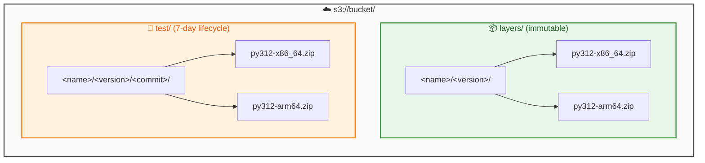

# Setup Guide

One-time setup for AWS Lambda Layers infrastructure.

## Prerequisites

- AWS account with permissions to create S3 buckets and IAM roles
- GitHub repository with Actions enabled
- [Git](https://git-scm.com/) for version control and change detection
- [uv](https://docs.astral.sh/uv/) installed locally
- [Terraform](https://www.terraform.io/) >= 1.12.1
- Python 3.11+ (for build scripts)
- Python packages: `boto3`, `packaging` (for validation scripts)
- [AWS CLI](https://aws.amazon.com/cli/) configured with credentials
- `zip` command (usually pre-installed on Linux/macOS)

## S3 Artifacts Bucket

Layer artifacts are stored in a shared S3 bucket. The bucket should be provisioned separately (e.g., by a shared infrastructure Terraform component).

### Required Bucket Configuration

| Setting | Value | Purpose |
|---------|-------|---------|
| **Versioning** | Enabled | Track artifact history, enable recovery |
| **Object Lock** | GOVERNANCE mode (optional) | Enforce immutability (prevent overwrites/deletes) |
| **Bucket Policy** | Cross-account read | Allow target accounts to read artifacts |

### Recommended Bucket Configuration

| Setting | Value | Purpose |
|---------|-------|---------|
| **Cross-Region Replication** | To secondary region(s) (optional) | Disaster recovery, reduced latency |
| **Lifecycle Rules** | Transition to IA after 90 days | Cost optimization for old versions |
| **Lifecycle Rules** | Delete `test/` prefix after 7 days | Cleanup test artifacts |
| **Encryption** | SSE-S3 or SSE-KMS | Data at rest encryption |

### S3 Key Structure

The bucket uses two prefixes with different purposes:



| Prefix | Purpose | Lifecycle |
|--------|---------|-----------|
| `layers/` | Production release artifacts | Immutable, never overwritten |
| `test/` | Test builds (per commit) | Immutable per commit, auto-deleted after 7 days |

**Note:** Each commit creates a unique test artifact path (`test/<name>/<version>/<commit>/`), so multiple testers can safely test different commits from the same PR without conflicts.

### Lifecycle Policy for Test Artifacts

Configure a lifecycle rule to automatically clean up test artifacts:

```json
{
  "Rules": [
    {
      "ID": "DeleteTestArtifacts",
      "Status": "Enabled",
      "Filter": {
        "Prefix": "test/"
      },
      "Expiration": {
        "Days": 7
      }
    }
  ]
}
```

### Example Bucket Policy (Cross-Account Read)

#### Option 1: Allow entire AWS Organization

```json
{
  "Version": "2012-10-17",
  "Statement": [
    {
      "Sid": "AllowOrganizationRead",
      "Effect": "Allow",
      "Principal": "*",
      "Action": [
        "s3:GetObject",
        "s3:GetObjectVersion"
      ],
      "Resource": "arn:aws:s3:::BUCKET_NAME/*",
      "Condition": {
        "StringEquals": {
          "aws:PrincipalOrgID": "o-xxxxxxxxxx"
        }
      }
    }
  ]
}
```

#### Option 2: Allow specific AWS accounts

```json
{
  "Version": "2012-10-17",
  "Statement": [
    {
      "Sid": "AllowSpecificAccountsRead",
      "Effect": "Allow",
      "Principal": {
        "AWS": [
          "arn:aws:iam::111111111111:root",
          "arn:aws:iam::222222222222:root"
        ]
      },
      "Action": [
        "s3:GetObject",
        "s3:GetObjectVersion"
      ],
      "Resource": "arn:aws:s3:::BUCKET_NAME/*"
    }
  ]
}
```

## GitHub Repository Configuration

### Required Repository Variables

Configure these in GitHub repository settings → Secrets and variables → Actions → Variables:

| Variable | Description | Example |
|----------|-------------|---------|
| `LAMBDA_LAYERS_BUCKET` | S3 bucket for artifacts | `my-lambda-layers` |
| `AWS_REGION` | AWS region for deployment | `eu-west-1` |
| `AWS_ROLE_ARN` | IAM role ARN for OIDC auth | `arn:aws:iam::123456789012:role/github-actions` |

### Environment for Test Uploads

Configure the `test-upload` environment in GitHub repository settings → Environments:

1. Create environment named `test-upload`
2. Add required reviewers (optional, for controlled test deployments)
3. This environment gates the upload of test artifacts to S3

## OIDC Authentication Setup

GitHub Actions uses OIDC (OpenID Connect) to authenticate with AWS without long-lived credentials.

### Step 1: Create IAM Identity Provider

```bash
aws iam create-open-id-connect-provider \
  --url https://token.actions.githubusercontent.com \
  --client-id-list sts.amazonaws.com \
  --thumbprint-list 6938fd4d98bab03faadb97b34396831e3780aea1
```

### Step 2: Create IAM Role with Trust Policy

```json
{
  "Version": "2012-10-17",
  "Statement": [
    {
      "Effect": "Allow",
      "Principal": {
        "Federated": "arn:aws:iam::ACCOUNT_ID:oidc-provider/token.actions.githubusercontent.com"
      },
      "Action": "sts:AssumeRoleWithWebIdentity",
      "Condition": {
        "StringEquals": {
          "token.actions.githubusercontent.com:aud": "sts.amazonaws.com"
        },
        "StringLike": {
          // Example: "repo:luk-kop/aws-lambda-layers:*"
          "token.actions.githubusercontent.com:sub": "repo:ORG/REPO:*"
        }
      }
    }
  ]
}
```

### Step 3: Attach S3 Permissions to Role

```json
{
  "Version": "2012-10-17",
  "Statement": [
    {
      "Effect": "Allow",
      "Action": [
        "s3:PutObject",
        "s3:GetObject",
        "s3:ListBucket"
      ],
      "Resource": [
        "arn:aws:s3:::BUCKET_NAME",
        "arn:aws:s3:::BUCKET_NAME/*"
      ]
    }
  ]
}
```

For detailed instructions, see [GitHub Actions OIDC with AWS](https://docs.github.com/en/actions/security-for-github-actions/security-hardening-your-deployments/configuring-openid-connect-in-amazon-web-services).

## Pre-commit Hooks

Install pre-commit hooks to validate before committing:

```bash
pip install pre-commit
pre-commit install
```

Hooks validate:

- `uv.lock` files are up-to-date
- Layer configurations are valid
- Terraform formatting

## Next Steps

Once setup is complete, see [Usage Guide](USAGE.md) for daily operations.
